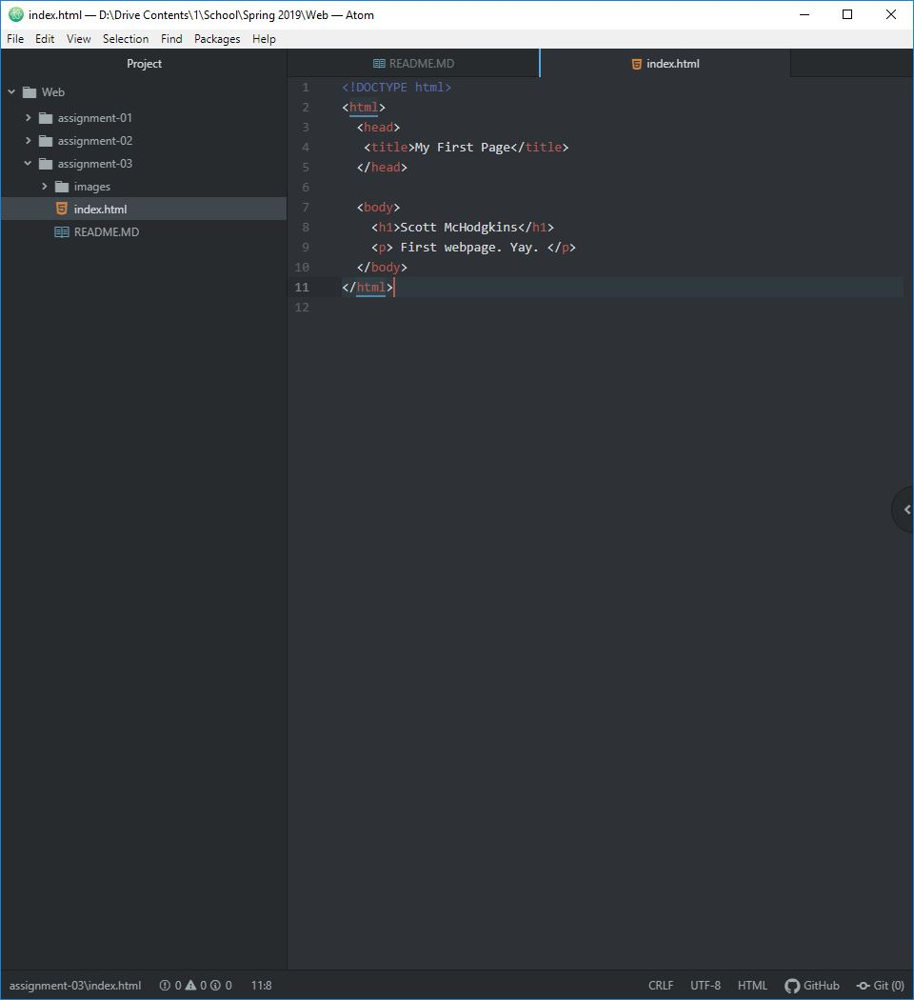

## Questions
1. Through a browser a web page server can be reached where the content can assemble locally according to instructions from the html and css. Engines render the from the DOM.

2. A markup language arranges the layout of a webpage’s contents. Focuses on text. The most commonly used markup language is HTML.

