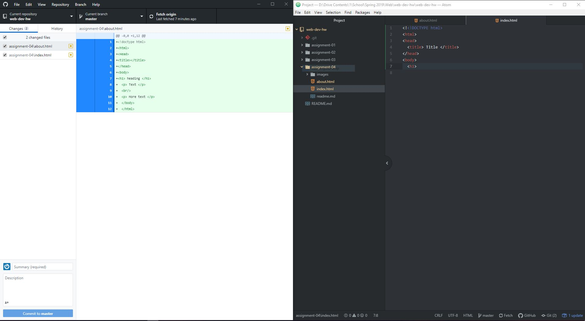

## Questions
1. I visited steampowered.com from around 2007. The design was much more cluttered then with less readability. Despite there being more information on screen now, its better organized and the layout of the page is structured in a way to lead you. Still emphasis on products and sales.

2. I learned quite a bit about Markup/down and some basic functions. Overall I'd say it was pretty easy and intuitive.

