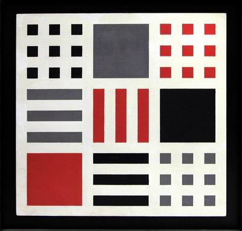

# Questions
---
1. The border is the direct line encompassing the content's boundaries. The padding property adds space between the content and the border. The margin is the space between elements.

2. 

3. **Work Cycle**
 - Started by finding some shape based abstract artwork
 - Created canvas, did some light maths
 - attempted to position elements with margins
 - That's not exactly working
 - Trying to use the position element and create block level elements
 - Doesn't seem to be tied to parent block like I'd of hoped (absolute?)
 - Oh, it might be working and I just missnumbered my rows
 - Woo, it appears to be working!
 - This is pretty awesome. I didn't think I'd be able to figure it out.
 - Positioning squares inside of squares inside of squares. Squareception.
 - Things are going well, but I think I could be more efficient about this. I'm repeating a lot of work.
 - Probably should of attributed more classes to my little squares
 - Hmmm. It appears that my absolute attribute doesn't apply to parent absolutes?
 - Guess I'll do it manually.
 - Got it done, but at what cost?!?
 - Pulled colors from adobe color wheel
 - Added text which I forced to display inline-block
 - Added a z-index square
 - Called it a day
 - I think I realized why things didn't work. I didn't position my squares in the rows before moving onto the interior elements. That sucks.
